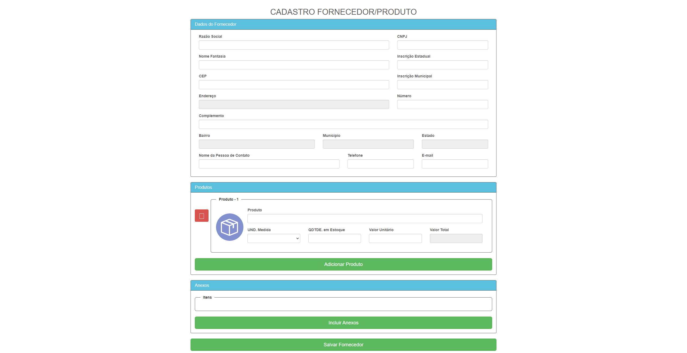
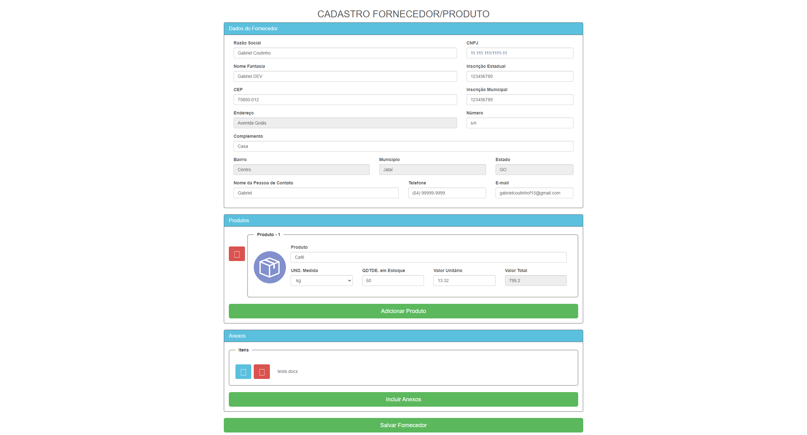
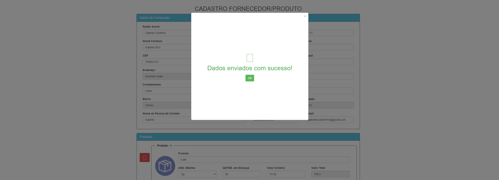

<h1 align="center">Desafio VFLOWS</h1>
<br>
<div align="center">
      <h3>Principal</h3>
      
      <h3>Preenchido</h3>
      
      <h3>Modal</h3>
      
</div>

<br>

## ⚙️ Tecnologias

Este projeto foi desenvolvido utilizando:

- [HTML](https://developer.mozilla.org/pt-BR/docs/Web/HTML)
- [Fluig Style (CSS)](https://style.fluig.com/)
- [Javascript](https://developer.mozilla.org/pt-BR/docs/Web/JavaScript)

## 📌 Começando

Clone o projeto:

```bash
git clone https://github.com/gabrielcoutinh0/Teste-Estagio-VFLOWS.git
cd Teste-Estagio-VFLOWS
```

## 🖼️ Layout

- [VFLOWS](https://github.com/VFLOWS/Teste-Estagio)
